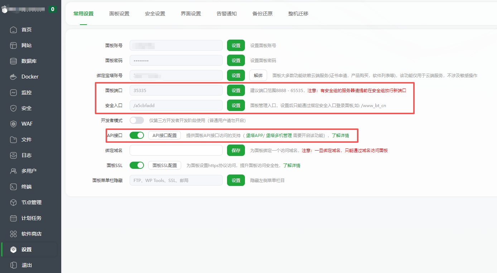

# bt-panel-mcp-server

让支持 MCP 的 AI 助手安全地操作宝塔面板（BT Panel）。它既提供适合日常运维的高层工具，也内置当前官方 API 文档中的完整操作目录：先检索接口定义，再以受控方式调用。

[](https://www.npmjs.com/package/bt-panel-mcp-server) [](https://www.npmjs.com/package/bt-panel-mcp-server) [](https://opensource.org/licenses/MIT)

[GitHub](https://github.com/SuxyEE/bt-panel-mcp-server) | [npm](https://www.npmjs.com/package/bt-panel-mcp-server) | [宝塔官方 API 文档](https://docs.bt.cn/api/)

## 能力概览

| 能力域 | 可以做什么 | 可用模式 |
|---|---|---|
| 站点诊断 | 列出站点、读取 Nginx/应用/面板日志、查询网站域名与备份 | readonly / full |
| 服务器观测 | CPU、内存、磁盘、网络、系统负载与面板操作日志 | readonly / full |
| 文件与配置读取 | 读取任意指定文件、查看站点 Nginx 配置、按行数截取大日志 | readonly / full |
| 网站生命周期 | 创建、启停、删除站点，设置备注和到期时间，查询 PHP 版本和目录保护状态 | full |
| 域名与备份 | 绑定/解绑域名，列出、创建和删除网站备份 | full |
| 文件与 Nginx 写入 | 保存网站文件或 Nginx 配置 | full |
| 官方 API 全覆盖 | 查询并调用 369 个内置官方文档操作：系统、网站、数据库、文件、计划任务、FTP、SSL/ACME、SSH 安全、推送、项目部署、Java、Docker、反代等 | 目录 readonly；调用 full |

默认是 `readonly`，不会暴露写入或管理操作。只有明确设置 `BT_MODE=full` 才会启用完整管理能力。

## 官方 API 覆盖范围

内置目录来自宝塔官方 API 文档当前验证基线（面板 v11.7.0，文档提交 `1f8efe62fa9757d71a7259b063bd63e3775e2e3c`），共 **369 个可执行操作**。它不是把数百个工具同时塞入客户端，而是提供下面的稳定流程：

```text
search_bt_api  ->  get_bt_api_operation  ->  call_bt_api
查找能力           核对参数和路由              在 full 模式执行
```

| 官方模块 | 代表能力点 |
|---|---|
| 系统管理 | CPU/内存/磁盘/网络、服务启停、面板重启、升级、清理、守护任务 |
| 网站管理 | 站点创建与删除、SSL/HTTPS、重写、运行目录、流量限制、反代、重定向、安全响应头 |
| 数据库 | 数据库和用户、备份、导入状态、慢日志、错误日志、Binlog、MySQL 配置与状态 |
| 文件 | 文件和目录浏览、读写、复制、上传、解压、回收站、文件历史、权限、Webshell 扫描 |
| 计划任务与 FTP | 计划任务增删改查、执行日志、日志切割、自动备份、FTP 用户和权限管理 |
| 证书与安全 | SSL 订单和证书、ACME 申请与续签、DNS API、SSH 安全配置与安全扫描 |
| 项目与容器 | 项目部署、Java/Tomcat/Spring Boot、Docker 容器/镜像/网络/卷/应用商店、反向代理插件 |
| 其他 | 推送、后台任务、Web SSH 终端配置、密码管理、风险扫描 |

目录覆盖的是官方文档中的操作定义。目标面板是否能实际执行，仍取决于面板版本、插件是否安装、API 白名单、账号权限及参数有效性。

## 工具清单

### readonly 模式

| 工具 | 作用 |
|---|---|
| `list_sites` | 列出宝塔已管理的网站，可按名称或域名搜索 |
| `get_nginx_logs` | 读取指定站点的 Nginx 访问/错误日志，支持自动路径探测 |
| `get_app_logs` | 查找和读取 Laravel、ThinkPHP、Java、Node.js 等常见应用日志 |
| `get_panel_logs` | 查询面板操作日志，用于审计与排障 |
| `get_system_status` | 汇总 CPU、内存、磁盘、网络和系统负载 |
| `read_file` | 读取服务器上的指定文件，可限制最后 N 行 |
| `get_nginx_config` | 读取站点的 Nginx 虚拟主机配置 |
| `list_domains` | 查询站点绑定的域名和端口 |
| `list_backups` | 查询站点备份记录 |
| `search_bt_api` | 搜索 369 个官方 API 操作，按模块、操作名或说明筛选 |
| `get_bt_api_operation` | 返回一个官方操作的 HTTP 方法、路径、固定 action、必填参数与说明 |

### full 模式新增工具

| 工具 | 作用 | 风险提示 |
|---|---|---|
| `manage_sites` | 创建、启停、删除站点；设置备注、到期时间 | 删除可选地连同目录、数据库、FTP 一起删除 |
| `manage_domains` | 绑定或解绑域名 | 影响站点可访问域名 |
| `manage_backups` | 创建或删除网站备份 | 删除后未必可恢复 |
| `save_nginx_config` | 覆盖站点 Nginx 配置 | 保存后立即影响站点服务 |
| `save_file` | 覆盖服务器上指定文件 | 可能影响应用运行或泄露敏感内容 |
| `call_bt_api` | 执行内置官方目录中的任意操作 | 包含删除、重启、升级、证书、容器和数据库等高风险操作 |

`BT_API_KEY`、`request_time`、`request_token` 与目录规定的 `action` 不接受 MCP 调用方传入，均由服务端生成或注入。

## 快速开始

### 1. 开启宝塔 API

登录宝塔面板，进入「设置」->「常用设置」：



1. 记下**面板端口**，例如 `35335`。
2. 记下**安全入口**；例如 `/a5cbfadd`。它需要放进 `BT_PANEL_URL`，但 API 请求会自动从站点根路径发起。
3. 打开 **API 接口**，复制接口密钥，并将 MCP 运行主机 IP 加入 API 白名单。

### 2. 配置 MCP 客户端

推荐通过 `npx` 运行：

```json
{
  "mcpServers": {
    "bt-panel": {
      "command": "npx",
      "args": ["-y", "bt-panel-mcp-server"],
      "env": {
        "BT_PANEL_URL": "https://服务器IP:面板端口/安全入口",
        "BT_API_KEY": "你的API密钥",
        "BT_MODE": "readonly"
      }
    }
  }
}
```

本地源码运行时，把 `args` 改为本项目 `dist/index.js` 的绝对路径。配置文件位置因 Cursor、Claude Desktop、Windsurf、Cherry Studio、Cline 等客户端而不同，请使用各客户端的 MCP 设置入口。

### 3. 先做只读连通性检查

重启 MCP 客户端后，先让 AI 执行：

```text
列出宝塔面板的所有网站，并告诉我当前服务器 CPU、内存和磁盘使用情况。
```

成功后再按需把 `BT_MODE` 改为 `full` 并重启客户端。不要在不理解影响范围时直接要求 AI 删除、升级或重启服务。

## 环境变量

| 变量 | 必填 | 默认值 | 说明 |
|---|---|---|---|
| `BT_PANEL_URL` | 是 | - | 面板地址，例如 `https://192.0.2.10:35335/a5cbfadd`；支持端口和安全入口 |
| `BT_API_KEY` | 是 | - | 宝塔 API 接口密钥；只放在 MCP 服务器环境变量中 |
| `BT_MODE` | 否 | `readonly` | `readonly` 仅开放查询/目录工具；`full` 开放所有管理和官方 API 调用 |
| `BT_ALLOW_INSECURE_TLS` | 否 | `false` | 仅在确认目标可信且无法配置有效证书时设为 `true`；生产环境应保持 TLS 校验开启 |

安全入口、API 密钥、密码、Token、证书私钥和数据库凭据都不应写入自然语言提示词、URL、浏览器代码或 Git 仓库。

## 使用官方 API 目录

### 查询一个能力

例如让 AI 查找 Docker 容器、数据库或证书操作：

```text
搜索宝塔官方 API 中与 Docker 容器列表有关的操作，列出可用 ID 和必填参数。
```

也可以直接调用 `search_bt_api`：

```json
{ "query": "容器列表", "module": "docker", "include_parameters": false }
```

### 获取准确参数

对要执行的操作先调用 `get_bt_api_operation`：

```json
{ "operation": "database/GetDatabasesList" }
```

返回结果会包含请求方法、路径、固定 action、必填参数、类型和官方说明。不要根据猜测拼参数。

### 执行操作

确认目的和参数后，在 `BT_MODE=full` 下调用 `call_bt_api`：

```json
{
  "operation": "database/GetDatabasesList",
  "params": {
    "p": 1,
    "limit": 20,
    "sid": 0
  }
}
```

对于带密码、私钥、DNS API Key 或容器配置的操作，`params` 仍可能包含敏感数据；仅在用户已明确授权向其自己的宝塔面板发送这些值时执行。

## 常见工作流

### 故障排查

```text
1. 列出站点并确认目标名称
2. 读取最近 200 行 Nginx error 日志
3. 读取应用日志，比较同一时间段的异常
4. 查询系统负载、内存、磁盘和网络
5. 只在原因明确后修改配置；修改前先读取原文件并保留回滚内容
```

可直接对 AI 说：

```text
排查 example.com 最近的 502：先看 Nginx 错误日志、再看应用日志和系统负载；只报告证据，不修改任何配置。
```

### 建站和内容发布

```text
1. 用 manage_sites 创建站点和目录
2. 用 list_domains / manage_domains 核对域名绑定
3. 用 save_file 写入 index.html 或应用配置
4. 用 get_nginx_config 复核虚拟主机配置
5. 在公网或目标网络访问站点，确认 HTTP 状态、证书和内容
```

### 数据库、证书、Docker 或计划任务

```text
1. search_bt_api 找到准确的官方操作
2. get_bt_api_operation 读取参数、前置条件与影响范围
3. full 模式下 call_bt_api 执行
4. 再用对应查询操作验证最终状态、日志或任务结果
```

涉及删除、覆盖、重启、升级、清理 Binlog、证书替换、容器删除或数据库用户权限变更时，应先说明目标对象、影响范围和回滚方式，再执行。

## 边界与安全模型

- `readonly` 不提供写入和官方 API 调用，但 `read_file` 仍能读取指定文件；不要读取无关的 `.env`、私钥或凭据文件。
- `full` 是权限开关，不是自动授权。执行破坏性操作前应取得针对具体目标的明确许可。
- `call_bt_api` 只允许调用内置官方目录中的操作，不接受任意 URL、任意 HTTP 方法或用户自定义 `action`。
- API 目录来自文档，不是目标主机的能力探测。某些 Docker、Java、反向代理、SSL 或商业插件接口在未安装时会失败。
- HTTPS 默认验证服务端证书。自签名证书需要显式设置 `BT_ALLOW_INSECURE_TLS=true`，此时应确保访问网络可信。
- API 接口可能随宝塔面板版本变更；每次面板大版本升级后，应先在测试环境验证关键调用。

## 常见问题

**提示 `Missing required environment variables`**

检查 MCP 进程环境中是否同时有 `BT_PANEL_URL` 和 `BT_API_KEY`，修改后完全重启客户端。

**请求超时、403 或 API 白名单错误**

确认面板地址/端口正确，MCP 主机 IP 已加入 API 白名单，且防火墙、安全组允许访问面板端口。安全入口需要写入 `BT_PANEL_URL`。

**HTTPS 连接报证书错误**

优先为面板配置可信证书。只有在确认内网链路和目标身份可信时才设置 `BT_ALLOW_INSECURE_TLS=true`。

**官方操作执行失败**

先用 `get_bt_api_operation` 重查参数，再确认面板版本、对应插件、账户权限和 API 白名单。文档目录覆盖不保证旧版本面板或未安装插件支持该操作。

**full 模式有什么风险**

它可以修改站点、配置、文件、数据库、证书、容器和系统服务。对生产环境应保持备份、先读取现状、执行后独立验证，并保留回滚内容。

## 本地开发与目录更新

```powershell
npm ci
npm run build
node dist/index.js
```

更新官方目录时，先获取 `cnb.cool/btpanel/docs`，再运行：

```powershell
$env:BT_OFFICIAL_DOCS_DIR = 'D:\src\btpanel-docs'
$env:BT_OFFICIAL_DOCS_REVISION = (git -C $env:BT_OFFICIAL_DOCS_DIR rev-parse HEAD)
npm run generate:api-catalog
npm run build
```

生成后应检查操作数量、抽查 GET/POST 路由和必填参数，再在目标面板或测试面板验证重点插件接口。

## 技术栈

- TypeScript
- Node.js >= 20
- `@modelcontextprotocol/sdk`
- 宝塔官方 API 文档目录生成器

## License

MIT
